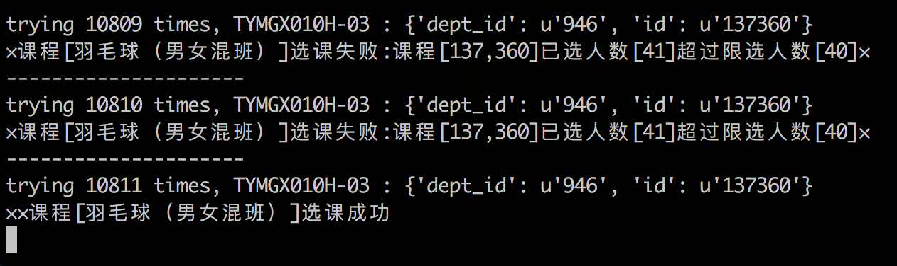

# UCAS_CC
国科大刷课脚本。(2017年秋季学期)

## 运行截图


## 说明
目前只能在内网使用, 外网需要破解验证码

## Environment
Python: 2.7

## Installation
``` sh
pip install -r requirements.txt
```

## Usage
``` sh
mv config.sample.py config.py   # 配置个人信息
python main.py                  # 开始选课
```

## LICENSE
MIT