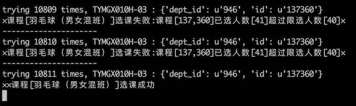
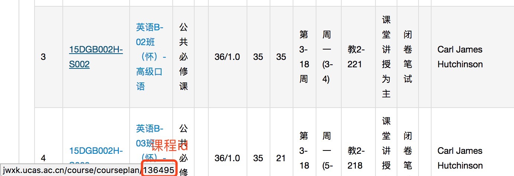

# UCAS_CC
国科大刷课脚本。(2017年秋季学期)

## 运行截图


## 说明
目前只能在内网使用, 外网需要破解验证码

## Environment
Python: 2.7

## Installation
``` sh
pip install -r requirements.txt
```

## Usage
### 修改配置
```
mv config.sample.py config.py      # 配置个人信息
```
### 抢课
``` sh
python main.py                     # 用于选人满的课
```
### 快速选课
``` sh
python fast_cc.py                  # 用于预先选课
```

## 快速选课说明
### depId配置

### sids配置


## LICENSE
MIT